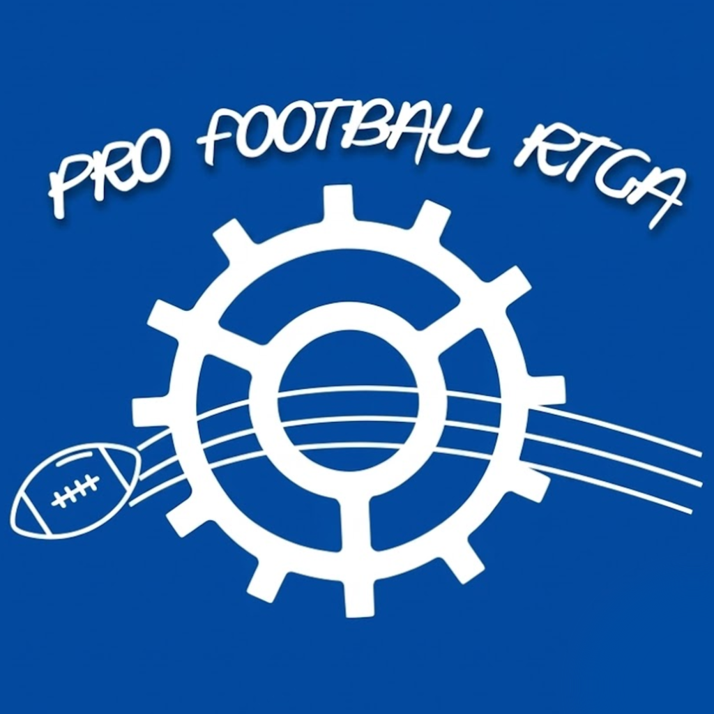

# Pro Football RTGA

**Random Team Generator & Analysis**

Build a completely random NFL team from real players, then simulate, analyze, and optimize it with real historical data and machine learning.

<!--
  Enable when the app is actually live.
  Apple's own guidelines prohibit using the "Download on the App Store" badge
  to promote an app that isn't yet published. Once live, delete the "Coming
  Soon" line below and uncomment the real badge with your App Store URL.

  
-->

[Marketing Site](https://pf-rtga-marketing-site.vercel.app/) • [Notion Page - Full App Writeup](https://intelligent-lupin-a6c.notion.site/Pro-Football-RTGA-Page-3c115e0a717080ceb491ec11f6df6846) • [Report a Bug](#support)

---

## Table of Contents

- [Why This App Exists](#why-this-app-exists)
- [Features](#features)
  - [Generate a Team](#generate-a-team)
  - [Analyze a Team](#analyze-a-team)
  - [Simulate a Game](#simulate-a-game)
  - [Optimize a Team](#optimize-a-team)
- [Tech Stack](#tech-stack)
- [Project Structure](#project-structure)
- [Data & Model Freshness](#data--model-freshness)
- [Contributing](#contributing)
- [Support](#support)
- [Donations](#donations)
- [License](#license)

---

## Why This App Exists

This started as a hobby project built around a simple question: how would a team of random NFL players actually perform over a real season, with no roster control and no front-office politics?

It grew into an end-to-end build: data pipelines pulling real NFL statistics, custom machine learning models trained on real play-by-play data, trained AI support to dive into the numbers, an MLOps layer to keep those models current, and a full production app around all of it. This is an actively evolving personal project, not a polished commercial product just yet, and it's been built without spending a cent on software infrastructure. If something looks off or you have any open suggestions, [open an issue](https://github.com/sat-malla/nfl-randomteam-analysis/issues).

## Features

### Generate a Team

Choose an offensive scheme (3 WR 1 TE or 2 WR 2 TE) and a defensive scheme (4-3 or 3-4 Base Defense), and the app assembles a full 29-player roster from real, currently active NFL players across all 32 teams from quarterback down to long snapper.

Selection isn't uniformly random: starters are weighted to appear more often than deep bench players, so rosters stay recognizable and fun to look at, while remaining unpredictable. No two generated teams can be the same in a randomized world filled with thousands of players.

### Analyze a Team

Run a full season projection for any generated team. The engine:

- Builds a statistical profile for every player from their real career stats (yards, touchdowns, tackles, sacks, interceptions, and more)
- Runs hundreds of simulated versions of a full 17-game season
- Factors in team-wide effects: offensive line quality, coaching history and record, opposing defense strength
- Outputs projected wins, playoff odds, and Super Bowl odds, plus individual player stat projections with realistic floor/ceiling ranges

A built-in AI analyst has access to the full analysis and can answer questions, give opinionated breakdowns, and summarize what a team's outlook actually means. It's like a sports analyst who's actually looked at the numbers.

### Simulate a Game

Play out a head-to-head game between a generated team and any real NFL team, from any season 2015–present, home or away. The simulation runs drive by drive and play by play, using machine learning models trained on real play-calling and outcome data to decide what happens on each snap. Runs, passes, sacks, turnovers, touchdowns, field goals... all building toward a real final score, a full box score, and game highlights.

**How the Machine Learning works, briefly:**
A Markov Chain model architecure which contains the following:
- One model predicts what happens on a given play (yardage, turnovers, touchdowns) from game situation and matchup context
- A second model predicts play-calling tendencies (run vs. pass) from down, distance, score, and time remaining
- A generative model fills in realistic team-season statistical profiles, especially useful for less-established players
- All three train on real historical NFL data and are retrained periodically as new seasons complete

### Optimize a Team

Flip the process around: instead of randomness, a salary cap and roster-size constraint are fixed, and a **Genetic Algorithm** (a popular optimization algorithm based on biological evolution) evolves thousands of possible roster combinations — testing, breeding, and mutating candidate rosters across "generations" of rosters — to converge on the lineup most likely to win a Super Bowl. Of course, not every user will get the same roster. But that's what makes it exciting and unpredictable. More to come on this feature where I can add more customization, personalization, and simulation. Be on the lookout for more!

## Tech Stack

| Layer | Technology |
|---|---|
| Frontend | React Native + Expo, TypeScript |
| Backend API | Go + Fiber |
| Databases | MongoDB (generated teams, live app data), Supabase/Postgres (historical NFL stats) |
| ML Microservices | Python (FastAPI): generative team-season modeling, team analysis, play-call prediction outcome prediction, game simulation (powered by both play-call and outcome models), team optimization |
| Model Tracking | Weights & Biases |
| CI/CD | GitHub Actions: includes an automated data refresh and model retraining pipeline (`.github/workflows`) |
| Deployment | Render (backend + microservices), EAS (iOS build and distribution) |

## Data & Model Freshness

The data pipeline automatically pulls fresh player stats, team performance, and coaching records as the season progresses. Models are retrained once a season wraps up during February, so projections reflect the current state of the league.

## Contributing

This repo is public and any sort of contributions regarding backend deployment and model efficiency/quality
are welcome. The current ML models are a reasonable starting point, but at times it can be slow especially when running hundreds of simulations for a single team's output. I believe there's many places for improvement on the backend side including hyperparameter tuning of the many models that power the Python microservices that make up the backend, additional training data and data fetching, or architecture changes.

If you're interested in improving the generative team-season model specifically, the training notebook has a dedicated section walking through which hyperparameters matter and how to validate an improvement before opening a PR or any sort of contribution.

For anything else, open an issue describing what you'd like to change before submitting a large PR. Happy to discuss direction, thought processes, and design changes first, if any.

## Support

Built-in support access lets you send a message directly from the app if you hit a bug, have a feature request, or just want to reach out. In the app: **Settings --> Support**. Or, you may submit an issue here on this repository.

## Donations

This app runs on real free-tier infrastructure such as servers, databases, and ML compute for retraining, running, and render. Especially when app usage increases, it's imperative to upgrade which will cost a significant amount for many of these third-party services. Donations are entirely optional with no paywalled features anywhere else in the app. If you'd like to support it: **Settings --> Donate**.

# Terms & Conditions
Please read the full Terms & Conditions of the app and service here: [Pro Football RTGA: Terms & Conditions](https://intelligent-lupin-a6c.notion.site/Pro-Football-RTGA-Terms-Conditions-3ca15e0a717080398ad4f586fc8a9669)

# Privacy Policy
Please read the full Privacy Policy of the app and service here: [Pro Football RTGA: Privacy Policy](https://intelligent-lupin-a6c.notion.site/Pro-Football-RTGA-Privacy-Policy-3c115e0a7170809fad70ce539efa7e10)

## License

© <!-- YEAR -->2026<!-- YEAR --> Pro Football RTGA. All rights reserved.

Last Updated: 2026-08-30

*Apple, the Apple logo, and App Store are trademarks of Apple Inc., registered in the U.S. and other countries.*